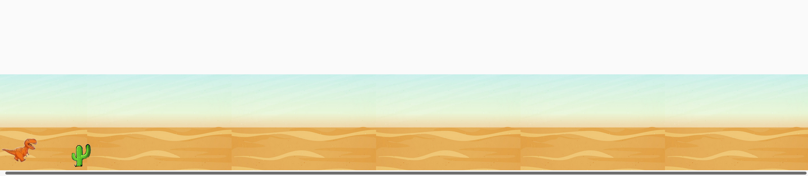

# PROJETO DESENVOLVIDO PARA RECRIAR O FAMOSO JOGO DO DINOUSSAURO DO GOOGLE 🦖

## ESTRUTURA DO PROJETO 

JogoDinossauro\acao\js.js -------------------	Responsável pelas ações do jogo

JogoDinossauro\estilo\css.css -----------------------	Responsável pela estilização do jogo

JogoDinossauro\imagens\---------------------	Responsável por guardar as imagens usadas no jogo

JogoDinossauro\index.html------------------- Responsável pela interface do programa, utilizando linguagem de formatação Html5.

--------------------------------------------------------------------------------------------------------------------------------------------------------------------

## FERRAMENTAS UTILIZADAS

Visual Studio Code-------------------- Para escrita do código fonte da programação do jogo

Interface------------------------------------ Mozila Firefox

Sistema Operacional --------------------------Linux- Ubuntu 20.4

	

